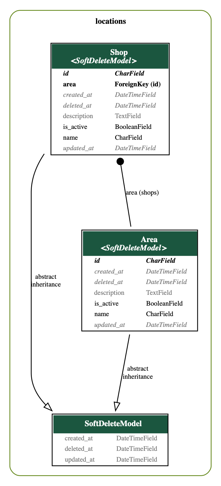

# Econet Technical Assessment

- REST API for  a small location management service

## Relevant Endpoints
- [Create Shop Under Area](http://127.0.0.1:8000/api/1.0/areas/<area_id>/shops)
```bash
curl --location 'http://127.0.0.1:8000/api/1.0/areas/area_jPxrCuJsiXzGGM0m8WqrV3k5yRwIp0/shops' \
--header 'Content-Type: application/json' \
--data '{
    "name": "Rimbi"
}'
```
- [Retrieve All Shops Under Area](http://127.0.0.1:8000/api/1.0/areas/<area_id>/shops)
```bash
curl --location 'http://127.0.0.1:8000/api/1.0/areas/area_jPxrCuJsiXzGGM0m8WqrV3k5yRwIp0/shops'
```

## ER Diagram

